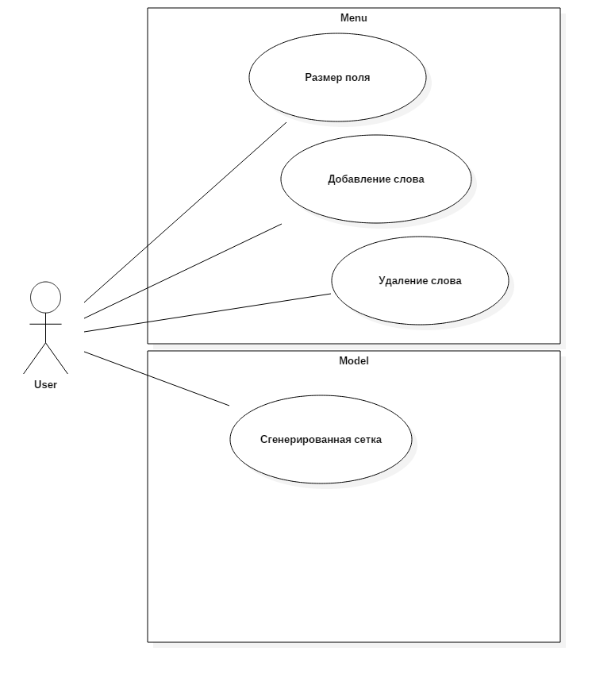
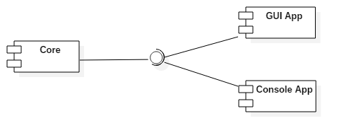

# Кроссворд

## Задание
Создание кроссворда (создание сетки кроссворда).

Игра будет происходить в оконном режиме. На поле размер, которого указувает пользователь. Должно быть реализовано добавление и удаление слова, сохранение кроссворда. 

## Концепция (vision statement) 
Готовый продукт является кроссплатформенным и содержит приложение как консольное, так и с графическим интерфесом. Имеется возможность выбрать размер поля: 10х10, 15х15, 20х20

## Минимально работоспособный продукт (Minimum viable product)
Наличие алгоритма при котором будет генерироваться сетка кроссворда.
## Диаграмма прецедентов использования

## Диаграмма последовательностей

## Диаграмма компонентов

