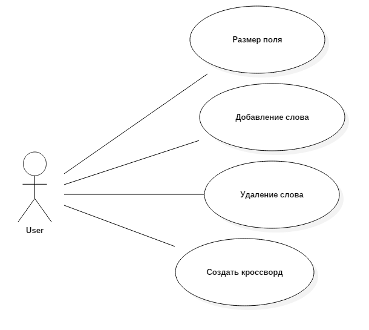

# Кроссворд

## Задание
Создание кроссворда (создание сетки кроссворда).

Игра будет происходить в оконном режиме на поле размер которого создаёт пользователь. Должно быть реализовано сохранение текущей игры и загрузка игры с последнего момента. 

## Концепция (vision statement) 
Создается с точки зрения заказчика и конечных пользователей. Цель артефакта -- описать, как должен выглядеть успешный результат проекта. Иначе говоря, если проект завершается успешно, то как в этом случае должен выглядеть готовый продукт? Какими он обладает ключевыми характеристиками и функциями и как они могуть помочь пользователям выполнять их задачи? Концепция определяет на уровне руководства, в каком случае руководство может признать, что цель работы достигнута.

## Минимально работоспособный продукт (Minimum viable product)
Наличие алгоритма при котором будет генерироваться сетка кросворда.
## Диаграмма прецедентов использования

## Диаграмма последовательностей

## Диаграмма компонентов
